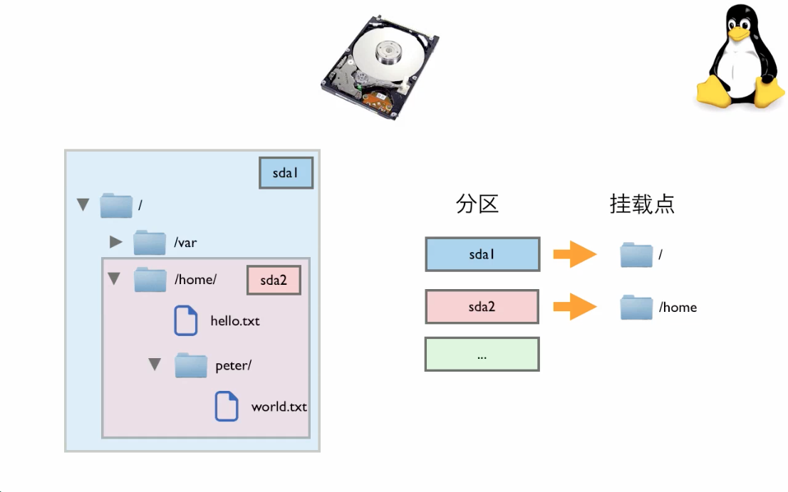
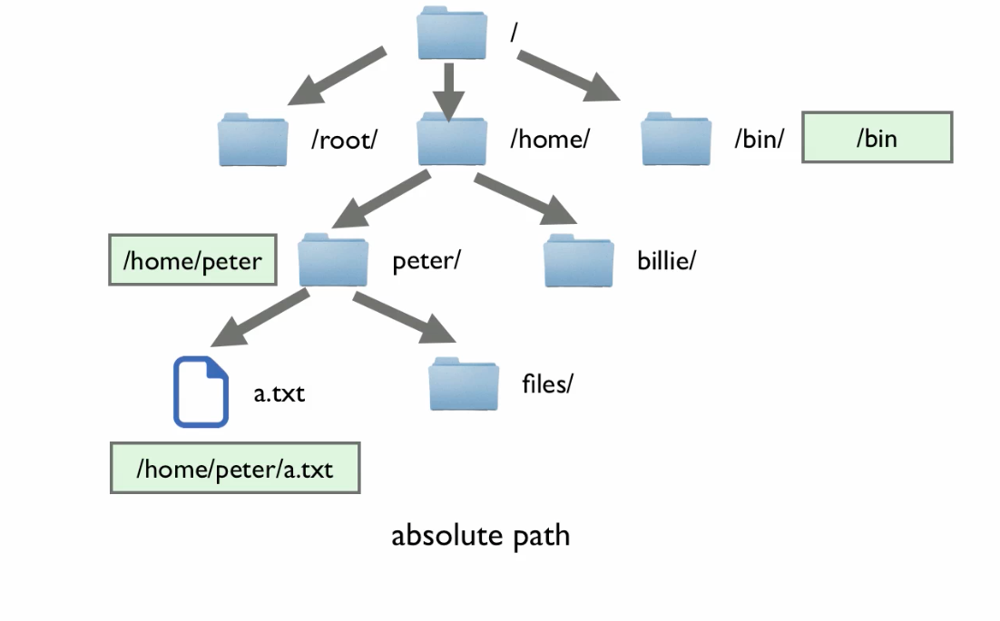
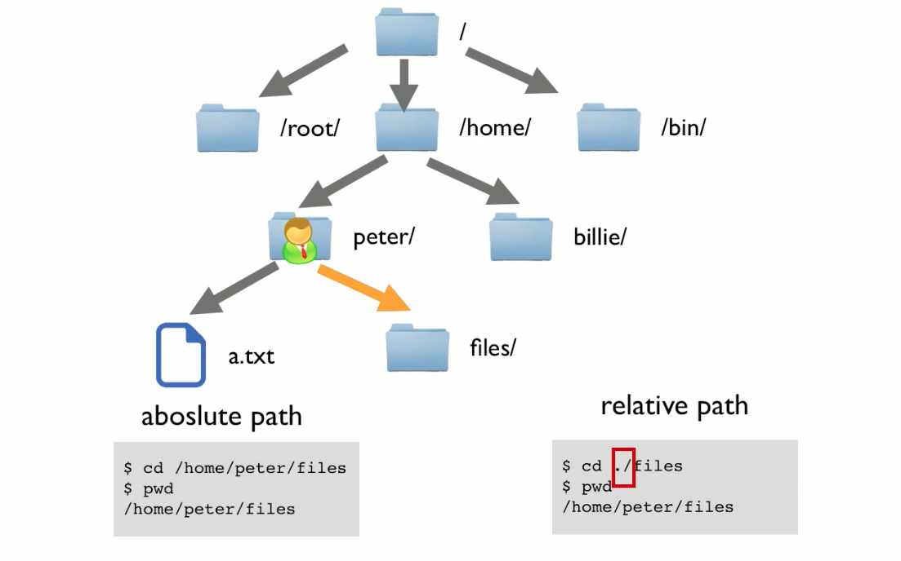

<a href="http://v.youku.com/v_show/id_XMzY2MDY3NjYw.html">视频</a>

系统准备好了之后，我们需要学习的第一件事就是怎样在文件系统树中跳转。这次课我们的主要内容有三小部分，首先用大概3分钟时间介绍一下文件系统树形结构，接下来是绝对路径和相对路径的概念，最后作为这些内容的实战，我们演示一下 cd 命令的使用。

# 理解文件系统树的结构

先来看看第一部分，Linux 系统下的文件系统是怎样的结构。

先聊聊 Windows 系统下的情况。在 Windows 系统中，我们会把硬盘分为多个分区（ C盘，D盘...）每个盘的最顶级都是多个文件夹（ folder ），每个文件夹下面有文件和子文件夹，子亦有孙，孙亦有子，形成一个树形结构。 每个分区会有自己的一个树。每一根儿树的最顶端是像 C: 或 D: 这样的盘符。

Linux 系统下的情况类似，硬盘也会被分为多个分区（ partition ），但是名字不叫 C 盘 D 盘，而是叫 sda1，sda2... 文件的组织也是一个树形结构。区别是，Linux 下把文件夹（ folder ）叫做目录（ directory ），而且整个系统不管有多少个分区，文件系统却只会有一棵树。树的顶端是一个目录（名字叫`/`）。

到这里我们就不理解了，分区有多个，但是文件系统树只有一个，那怎么对应呢？这就涉及到挂载点这个概念。
例如，如果我么把 sda1 挂载到名为`/`的这个目录上（目录其实就是文件系统树上的一个“点”，所以叫做挂载点）。那么由于系统上的所有文件和目录都包含于`/`这个目录之中，所以这样的话我们所有的数据都会存储到 sda1 这个分区上。

但是，如果我们在此基础之上，把sda2挂载到 `/home/` 这个目录上，那以后所有 `/home/` 下的数据就都存在 sda2 这个分区之上了。

分区情况，我们暂时不用关心。那我们这集视频中要玩转的对象就很简单了，就是 “Only One Tree”。

首先一个重要的概念是“根目录”，根目录指的是文件系统树的最顶端的名为`/`的这个目录，之所以把它叫根目录，是因为文件系统是一个倒挂的树，`/`是整个树的根（ root ），所有其他的文件和目录都是由此衍生出的枝蔓。所以根目录也可叫做“老祖宗”目录。

另一个重要概念是“当前工作目录”（ Current Working Directory ）。当前工作目录不是文件系统上的某个固定位置，而是当前用户所处的那个目录。
文件系统是一棵倒置的大树，我们能够站立在树中间某个点上，也就是位于一个目录中。这样我们用 ls 命令能够看到这个目录所包含的文件
还有子目录。那么，我们所处的这个目录就叫做“当前工作目录”。
可以使用`pwd`（ Print Working Directory，打印工作目录）命令，来显示当前工作目录名。

    $ pwd
    /home/peter/

也可以用`ls`这个命令来列出当前工作目录中的内容。

    $ ls
    a.txt files

# 绝对路径和相对路径
绝对路径名从根目录开始，其后跟随着一个个枝干（子目录）直到我们所期望的目录或文件。例如，系统中一个目录
的绝对路径名是 `/usr/bin` 。这意思是从根目录开始（由路径名中开头的`/`表示），
有一个叫做 `usr` 的目录，这个目录下包含一个叫做 `bin` 的子目录。

一个绝对路径名从根目录开始到达目的地，而相对路径则是从工作目录开始。文件系统使用几个
特殊的符号来表示在文件系统树中的相对位置。这些特殊符号是`.`和`..`。
这个`.`符号是指当前工作目录，而`..`符号是指当前工作目录的父目录。

当然 `./peter` 可以省略那个点，而写成 `peter`，我们基本上可以这样说，绝对路径是以 `/` 开头的路径，例如
`/home/peter`，而相对路径是以点开头的（可能是一个点，也肯定是两个点，当然一个点得时候，可以省略），例如 `./peter` 或者 `../billie`。

# 更改当前工作目录（ cd: Change Dir ）
更改你的工作目录（目录树中，我们所站之处），需要使用 cd 命令。为了实现目标，
输入 cd 命令，其后跟所期望到的工作目录。路径名就是我们沿着目录树枝干到达
我们所要目录所经过的路线。路径名可以用两种方式来指定，一个是绝对路径名，
另一个是相对路径名。

比如我们当前位置是 `/home/peter/` 如果我们想要把当前工作路径改为 `/home/peter/docs` 就可以有下面两种方式。

指定绝对路径

    $ cd /home/peter/docs
    $ pwd
    /home/peter/docs

指定相对路径：

    $ cd ./docs/
    $ pwd
    /home/peter/docs

通常`./`是可以省略的，也就是可以

    $ cd docs/
    $ pwd
    /home/peter/docs

原因就是如果我们在目录名（这里是 `docs` ）之前不写路径的话（也就是不加 `./` ），那系统默认取当前工作目录。

如果我们 cd 到系统根目录

    $ cd /
    $ ls

这是我们会看到很多系统默认就会有的目录，到底这些目录都是干嘛的呢？ 可以参考 <http://billie66.github.io/TLCL/book/zh/chap04.html> 中的 “
表 4-4: Linux 系统中的目录”这部分。

下面有个小技巧分享给大家，就是 ”tab 补齐“功能。不管我用绝对路径还是相对路径，只要我们的路径前面部分没有敲错，那么后面的部分是可能通过敲 tab 键自动补齐的。比如我们想跳转到当前目录下的 media 目录中，就可以敲 `cd me<tab>` 就可以了。如果匹配项不唯一那么也可以敲两下 tab 直接显示出所有备选项。

好这一节我们就聊这么多，更多内容可以看看 <http://billie66.github.io/TLCL/book/zh/chap03.html> 。
