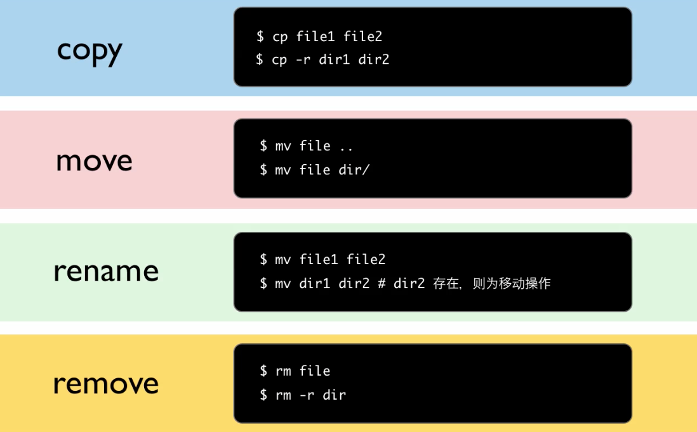

[观看视频](http://www.imooc.com/video/3528)

这集里我们开始真正的在 Linux 里留下我们的痕迹了，自己动手对文件进行拷贝，移动，删除，修改等各项操作。

先看一下这一集的主要内容，首先走马观花，浏览一下都有哪些日常使用的命令，过程中穿插一些实际演示，讲一些好玩的点。第二步，介绍通配符的使用，这里就看出使用命令行的优势来了，用鼠标只能一个一个的处理，用命令行可以批处理。最后，聊的是压缩和解压缩。

# 日常文件操作
大家平时用鼠标干的活，这里咱们用敲命令的方式快速做一遍。要覆盖到得内容包括，文件的 copy，move，rename，remove 操作，那相应的命令其实超级好记啦，基本就是这些英文单词的缩写。

复制文件目录

    $ cp -r dir1 dir2
    $ cp file1 file2

移动文件目录

    $ mv dir1 Desktop/dir1

重命名文件目录

    $ mv file1 file2
    $ mv dir1 dir2

删除文件目录

    $ rm file
    $ rm -r dir

创建文件目录

    $ mkdir dir
    $ touch file
    $ >file
    $ vim file

查看文件内容

    $ cat file # 适合比较短的文件
    $ less file # 有快捷键，可以看比较长的文件

查看文件类型 fiie

    $ file file1
    $ file dir1

查看文件大小

    $ du -k file
    $ du -m file

更多内容，参考 TLCL 的 《操作文件和目录》这一章：

<http://billie66.github.io/TLCL/book/zh/chap05.html>

下面开始实际操作游戏。把 terminal 窗口拉成半屏的，露出桌面来。现在我们敲

    $ pwd
    /home/peter

看到我们目前在 peter 这个用户的主目录里。每个用户的主目录里面都会有一个特殊目录，叫 Desktop，这个对应我们的桌面。比如我们

    $ cd Desktop
    $ mkdir mydir

我们就会看到，桌面上会蹦出一个新的文件夹来。可以敲 cd 不加任何参数，这样我们会自动回到 peter 的主目录。现在我们创建一个文件。

    $ touch a.txt

把它移动到 mydir 需要怎么操作呢？可以用相对路径来定位 mydir

    $ mv a.txt Desk<tab>/myd<tab>

再到桌面上新建一个目录

    $ mkdir dir1

来进行目录的拷贝

    $ cp -r dir1 dir2

这样成功的得到了 dir1 的一个副本 dir2 。但是如果同样的命令再执行一次，那么就会在 dir2 之内另外创建一个 dir1 了。

再稍微拓展一下内容。现在创建隐藏的文件和目录（名字前面加 .）

    $ pwd
    /home/peter/Desktop
    $ touch .aa
    $ mkdir .dir

这样用 ls 命令是看不到 .aa 和 .dir 的，要用 `ls -a` 才行。

下面我们在下载一个比较大的文件

    wget http://imooc.com

Linux 下有个特点，就是文件的后缀一般都可有可无，比如我们现在

    $ file index.html
    $ mv index.html index
    $ file index

发现不管有没有后缀，file 命令都可以正确地告诉我们这是个 html 文件。

这个文件比较长，如果用 cat 查看就比较难受，这次我们可以用 less 来查看

    less index.html

less 中可以使用 `j` `k` `gg` `G` 来进行跳转，用 `/-xxx` 来进行查找，man 用的就是 less 。后面我们学习黑客编辑器 vim 的时候，会发现这些操作也是一样的。

# 通配符的使用

如果我们到 <http://billie66.github.io/TLCL/book/zh/chap05.html> 的 ”通配符“ 这一步分，就会发现通配符的类型好多啊。另外我们应该也发现，任何一个 Linux 命令基本使用都很简短，但是打开 man

    $ man cp

都会发现里面的参数都是成片成片的，跟本不可能都记住。好在呢，系统的设计者根本就没有期待我们都记住，只需要记住几个最常用的，作为日常命令行使用就行。其他的那么多的参数，大部分是日常用的比较少，在写 shell 脚本的时候才会用到。因为没有人工的参与，语句需要写得比较严谨才行。如果要达到对字符串的比较精准的匹配，我们就会用到不是特别常用的通配符了，甚至还会用到正则表达式 <http://billie66.github.io/TLCL/book/zh/chap20.html>，正则表达式自己就够写一本书了，所有在我们这套课程里不深究。

我们可以把要记住的东西分类：

- 第一类，每天都要用的东西，例如常用命令。这个是要记到我们大脑的内存区域的，随时快速取用，有些个别的命令和编辑器快捷键甚至都不需要经过大脑，老外喜欢说一个词：“ muscle memory "，肌肉的内存中。
- 第二类，偶尔才会用的东西，脑子中知道他的原理，到时候知道去哪里查资料就行了，所谓的存到大脑硬盘区域了。

对于通配符，真正需要装入大脑内存部分的其实就是一个： * ，日常的命令行操作就够用了。几个实例：

    $ ls
    a.txt b.txt ccc.txt a.html hello.html

要删除所有文件，就用 `rm *`，不过我们可以先 `echo *` 看看 * 到底代替了那些文件。比如

    $ echo *.txt
    $ echo a*

# 文件打包
参考，TLCL 第19章：归档和备份 <http://billie66.github.io/TLCL/book/zh/chap19.html>
文章中各种压缩的方式很多，得到的压缩包格式也不少，看起来也稍微让人眼晕，所以我们这里还是按我自己一贯的风格来讲解，不求甚解，但求实用，给大家展示出实际开发中用的最多的几个实例。

例子一，网上下载源码，我们需要进行解压缩。<https://github.com/happypeter/happygrep> 上面 "download zip"

解压缩

    $ unzip x.zip

压缩

    $ zip -r x.zip x/

例子二，<http://ftp.gnu.org/gnu/wget/> 下载一个 xxx.tar.gz

    $ tar jxvf xxx.tar.gz
    $ tar jcvf xxx.tar.gz xxx/

例子三，<http://ftp.gnu.org/gnu/wget/> 下载 xxx.tar.bz2

    $ tar zxvf xxx.tar.bz2
    $ tar zcvf xxx.tar.bz2 xxx/

好，这一集就到这里了。
