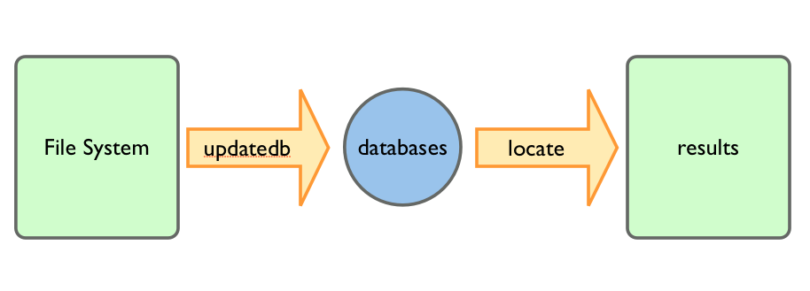
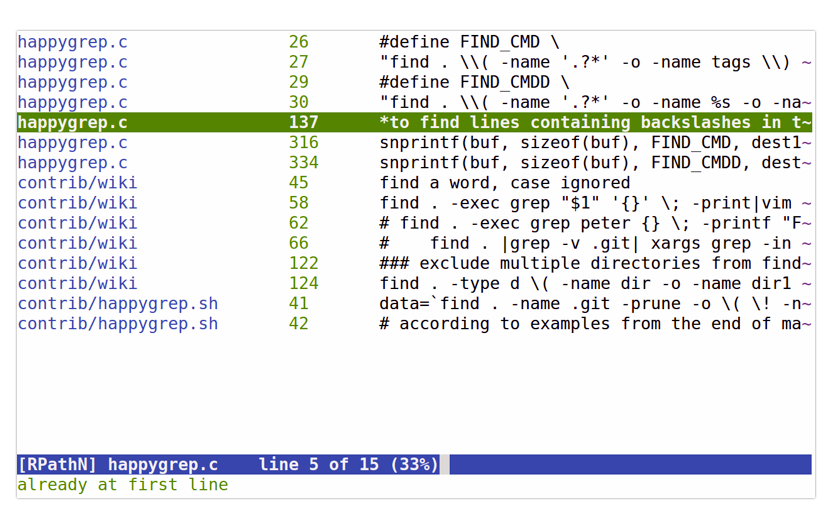

作为开发者，每天都在敲敲打打一些文件。在代码编辑器里经常涉及查找文件和字符串的操作，这里看看如何在命令行里实现。

本集主要涉三个命令：

- locate 在全系统范围内定位文件
- find 在一个目录之内定位文件
- grep 查找一个字符串

要聊的内容分三部分：

- locate
- find
- happygrep

# locate

先来个超级简单的。

      locate pattern

这样会找到系统上的任何路径中包含 `pattern` 的文件和目录，用通配符表示就是 `*pattern*` ( pattern 前后可以有0个或是多个任意字符)。

举个例子

    $ locate vimrc

如果要实现更为精确的搜索，可以用 --regexp 选项后面跟正则表达式。

但是，我们也会遇到奇怪的现象，比如现在有一个文件叫 happygrep.c ，但是如果运行 locate 去查找却找不到，奇怪，奇怪。

这个就要说到 locate 命令的运行原理了，打开它的 manpage

    $ man locate

这里面有一句：“ locate 查找的是由 updatedb 这个命令生成的数据库“，这个也解释了为何 locate 找东西会那么快。

可惜，updatedb 命令一般每天自动运行一次。所以最近我们才创建的文件是找不到的，解决方法也简单，手动运行一下

    $ updatedb

就好了。

# find

find 命令就是你给它指定一个目录，它就帮你翻个底朝天。

这里有一个目录 mydir，里面的情况是

    $ ls
    a.txt
    a.c
    b.txt
    subdir/

在当前目录找到文件后缀为 .txt 的文件

    $ cd mydir
    $ find .|grep .txt

还可以指定文件类型来进行筛选

    $ find . -type f

找到文件是为了操作文件

    $ find . -type f -exec ls -l '{}' ';'

查找当前目录下的文件内容，打印所有包含字符串 string 的行

    $ find . -exec grep string '{}' ';'

打印出行号，加 -n

    $ find . -exec grep -n string '{}' ';'

打印出文件名，加 -print

    $ find . -exec grep -n string '{}' ';' -print

另外，如果在一个代码项目内查找，ack-grep 比 grep 更方便。参考 <http://happycasts.net/episodes/26>

# happygrep

上面 find 命令的输出有点乱，不好看，并且我也希望能很快的用编辑器打开匹配项进行编辑，所以就自己写了个工具，叫 happygrep <https://github.com/happypeter/happygrep> 。

可以使用 git clone 的方式来下载，让后按照 README 上给出的方式进行安装。

装好之后，就可以进入一个目录，例如 edocs，查找我们想要的字符串，例如 keynote

    $ cd edocs
    $ xxx keynote

可以敲 e 就可以打开相应的匹配项用 vim 来编辑了。

好，这次要聊的就是这些啦，更多内容大家参考：

- 查找 ch18 <http://billie66.github.io/TLCL/book/zh/chap18.html>
- 正则表达式 ch20 <http://billie66.github.io/TLCL/book/zh/chap20.html>
